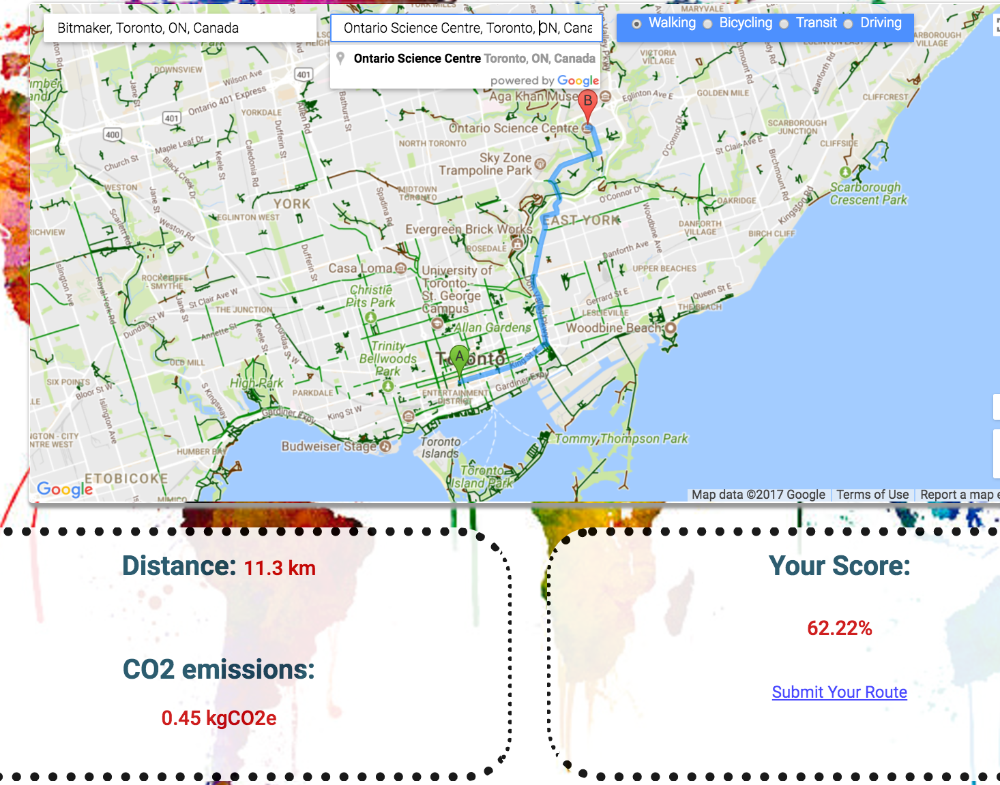

# ThruCO2

ThruCO2 lets you map a travel route, and calculates CO2 emissions of how you chose to get there. The app is hosted at pacific-fjord-26309.herokuapp.com/ .

Do you drive to work, or take the subway? The app scores users on their travel choices, tracking commuting habits over time individually, or as a team.

(The app is currently undergoing updates, and some discrepancies have been found between local functionality and Heroku functionality.) 

#The calculator

Scores are determined from emission factors as defined in DEFRA (Department for Business, Energy and Industrial Strategy) UK guidelines.

For this calculator, note that cycling was considered to be the baseline level in the scoring system, as it expended to least amount of energy. Emissions for walking and biking were assigned nominal factors to account for the fact that both tasks do expend some energy. Therefore, the combined reduction of energy expended and amount of personal risk taken on accounts for the scores observed in this calculator.

Users fill in a start and end address on the map; Google's autofill feature confirms a trip from Bitmaker Labs to the Ontario Science Centre (all trips are initially shown as taken on foot).

The given trip outputs distance, kgCO2e, and a score percentage value (high scores are the goal, in this case):

